# AI Prompt Enhance - Project Overview

Welcome to **AI Prompt Enhance**! This is a smart, user-friendly platform designed to help you interact with advanced AI effortlessly. Whether you're looking to have a casual chat, fix your writing, or dramatically improve your prompts to get the best responses, this tool is built specifically for you.

Below is a non-technical walkthrough of what users and administrators can do, complete with actual screenshots from the platform!

---

## Guest Experience

See what the platform looks like before you even log in! You can explore the basics right away.
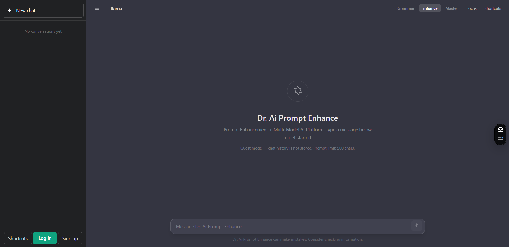

## Sign Up

Create your free account in seconds to unlock the core AI features.
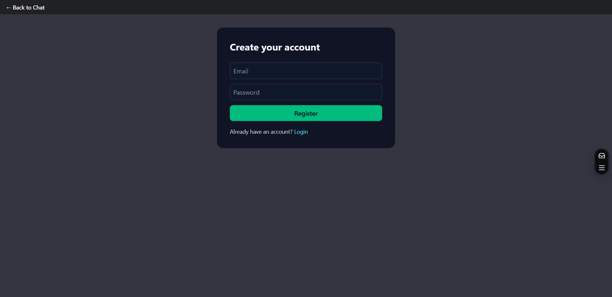

## Login

Securely access your personalized AI workspace where your past chats and shortcuts are saved.
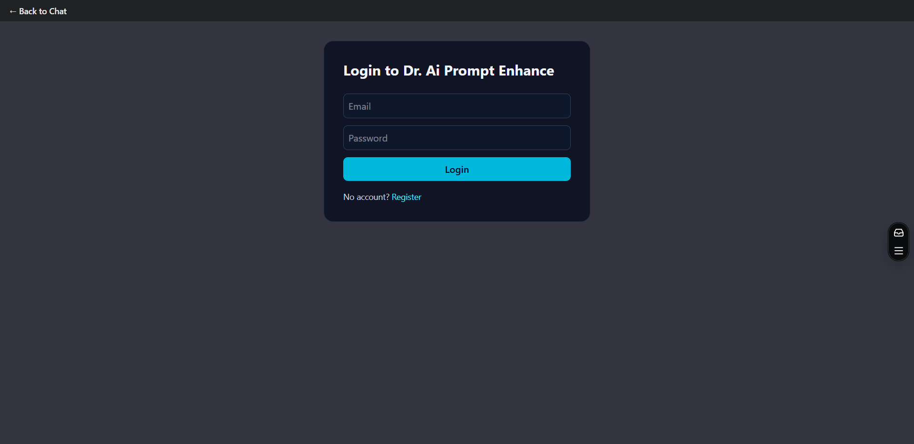

---

## 🧑‍💻 What a Normal User Can Do

Once you are logged in, you gain access to a powerful suite of daily tools. You don't need to be a tech expert—just type what you need!

### General User Dashboard

This is your main interface. Here, standard users can start a chat, create new prompts, and organize their daily work seamlessly.
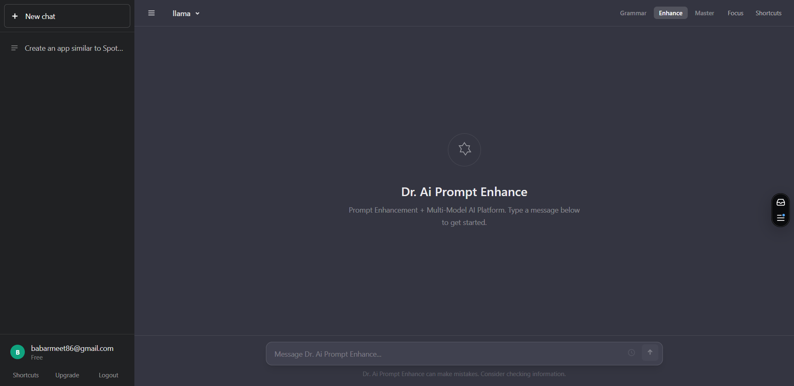

### Intelligent Assistant Modes

The platform revolves around unique "Modes" that tell the AI exactly how to help you.

#### Enhance Mode

Have a basic idea? The AI takes your simple thoughts and expands them into rich, detailed prompts so you get amazing results every time.
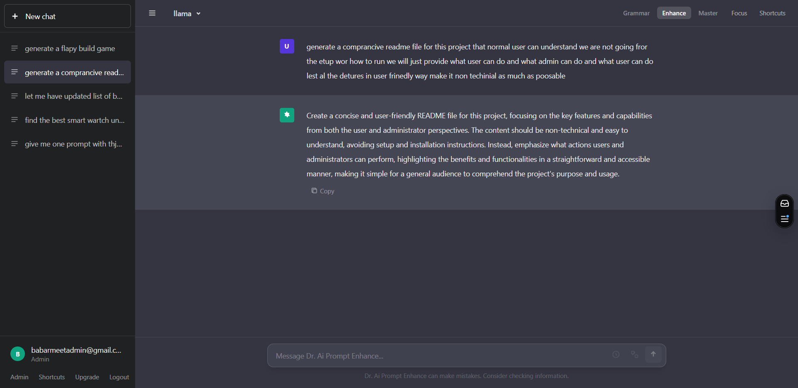

#### Grammar Mode

Your personal proofreader! Paste your text, and the AI will instantly fix typos, correct grammar, and improve your sentence structure.
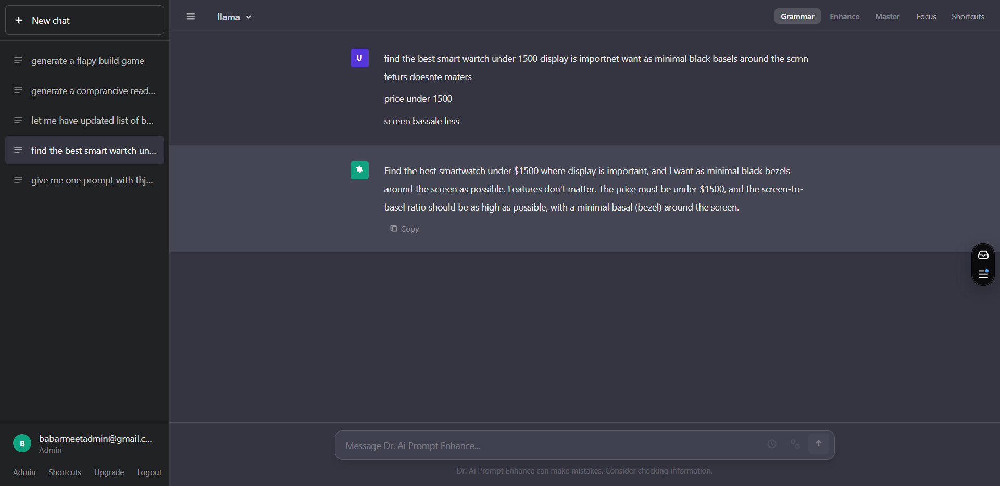

#### Master Mode

Unlock the AI's full, unrestricted potential for complex tasks, deep conversations, and advanced problem-solving.
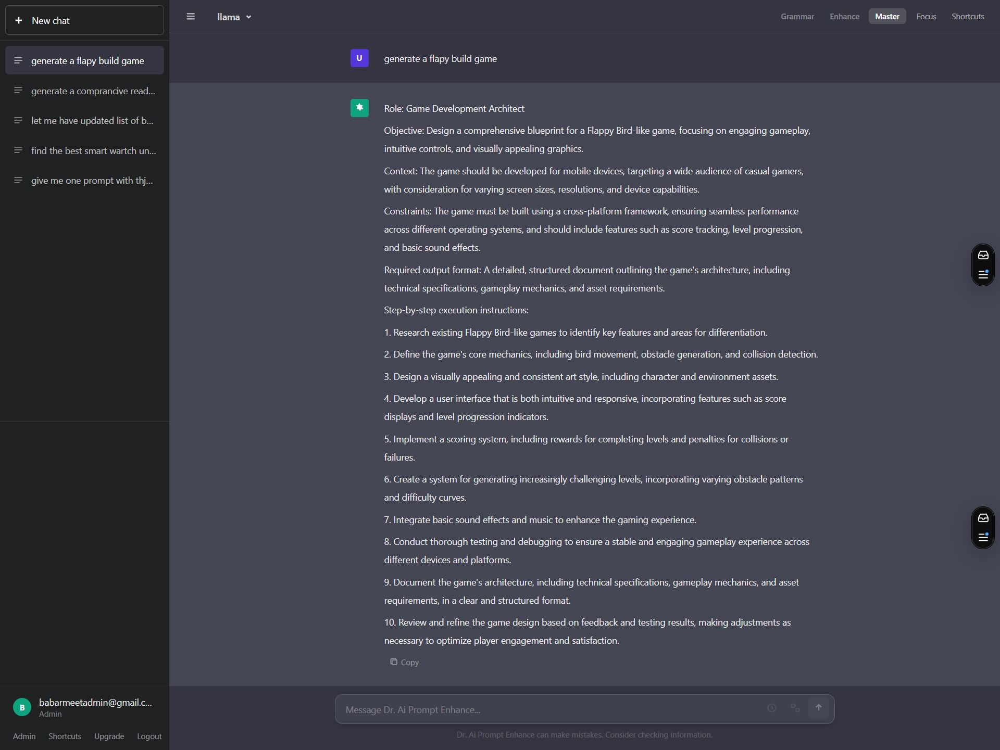

### Premium / Paid User Experience

Upgraded members get access to exclusive features, faster and smarter AI models, and a specially tailored dashboard designed for heavy usage.

---

## ⚙️ What an Administrator Can Do

Administrators have a special "behind-the-scenes" view to ensure the platform runs perfectly and safely for everyone.

### Admin Dashboard

The command center. Admins get a bird's-eye view of how the platform is performing.
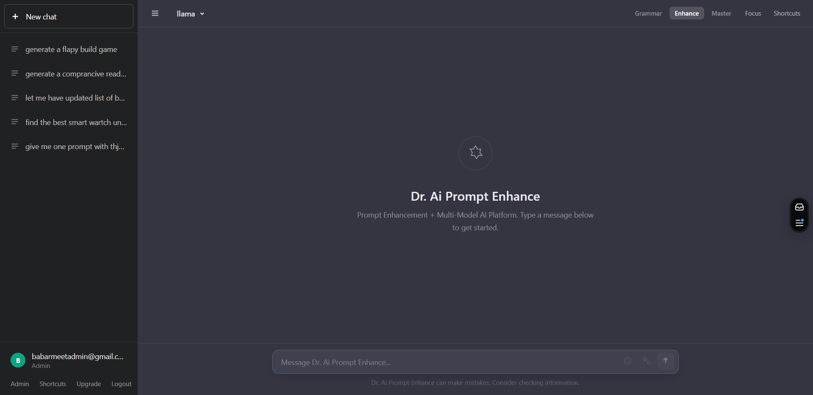

### User Management

Full control over the community. Admins can view profiles, assist users with their accounts, and manage who has paid subscriptions.
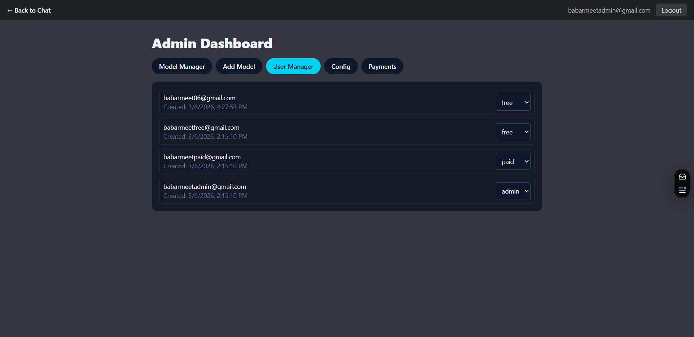

### Model Manager

The AI world moves fast! Admins can use this page to control which AI "brains" are active on the site, ensuring users always have access to the best technology available.
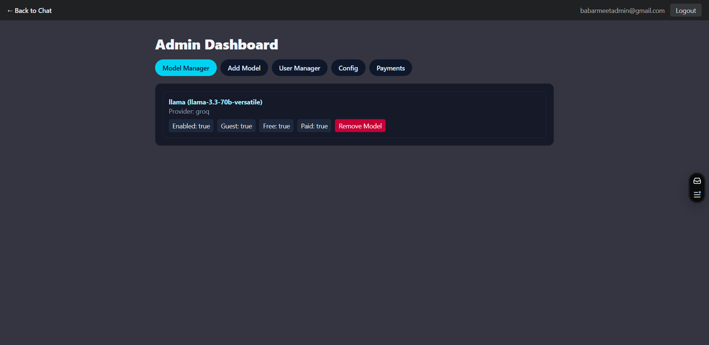

### Add New Models

Seamlessly plug entirely new AI integrations into the system with just a few clicks.
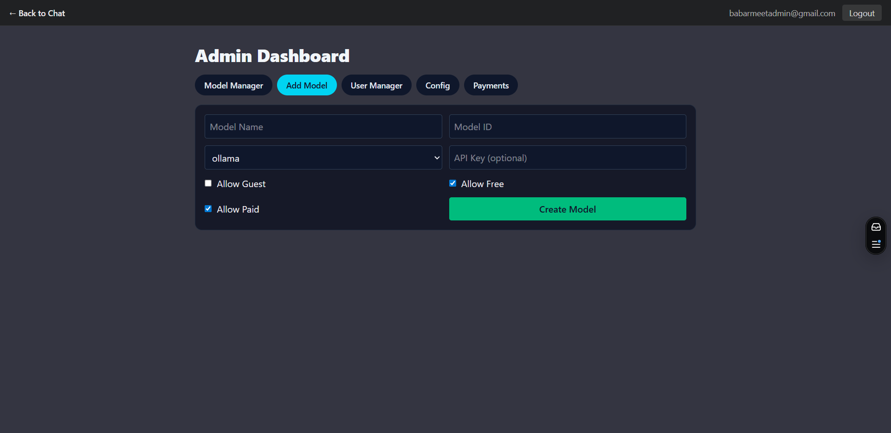

### System Configuration

The master control panel. Tweak general site settings, adjust global platform rules, and customize how the application behaves for everyone.
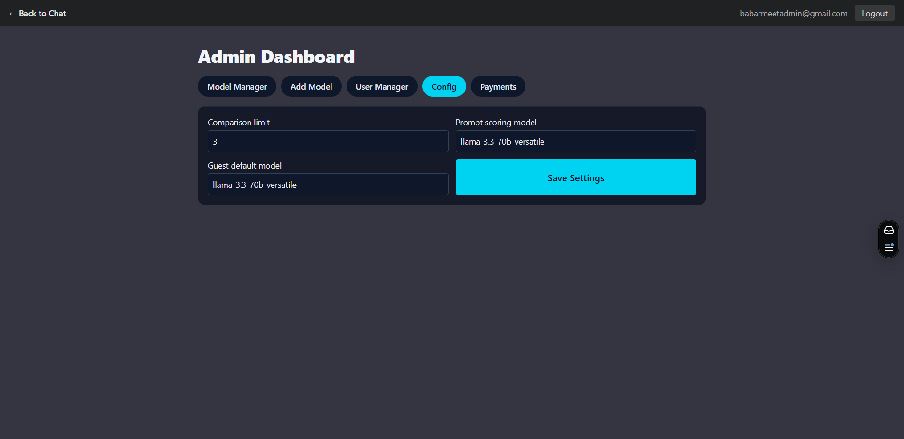
